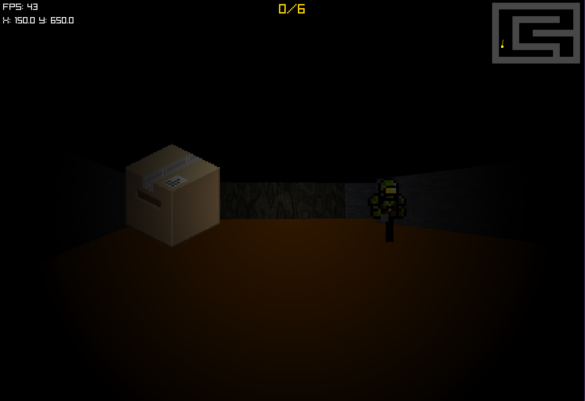

# Snake's Preparation - Raycaster Game 

Un juego de acción en primera persona con mecánicas de sigilo y recolección, desarrollado en Rust utilizando la biblioteca Raylib. (Video del gameplay hasta abajo del readme)

## 🎮 Descripción

"Snake's Preparation" es un juego de infiltración en primera persona donde encarnas a Solid Snake en una misión de infiltración en una base enemiga. El juego combina mecánicas de sigilo, recolección de objetos y supervivencia en un entorno oscuro donde solo puedes ver lo que alcanza la luz de tu linterna.

### Captura de Pantalla del Juego


## ✨ Características

- Gráficos 3D con renderizado por raycasting
- Sistema de iluminación dinámico con linterna
- Enemigos con IA que patrullan el mapa
- Múltiples niveles de dificultad
- Sistema de recolección de objetos
- Efectos de sonido y música ambiental
- Interfaz de usuario intuitiva
- Mapa en miniatura

## 🛠️ Requisitos del Sistema

- **Sistema Operativo:** Windows 10/11, Linux, o macOS
- **RAM:** 4GB mínimo
- **GPU:** Cualquier tarjeta gráfica moderna con soporte OpenGL 3.3+
- **Disco Duro:** 100MB de espacio libre
- **Dependencias:**
  - Rust (última versión estable)
  - Cargo (gestor de paquetes de Rust)

## 🚀 Cómo Ejecutar el Juego

### Instalación de Rust

Si no tienes Rust instalado, descárgalo e instálalo desde [rustup.rs](https://rustup.rs/)

### Clonar el Repositorio

```bash
git clone https://github.com/tu-usuario/raycasting_graficas.git
cd raycasting_graficas/project
```

### Ejecutar el Juego

```bash
# Navegar al directorio del proyecto
cd project

# Construir y ejecutar el juego
cargo run
```

## 🎮 Controles

### En el Menú Principal
- `1` - Iniciar nivel Fácil
- `2` - Iniciar nivel Difícil
- `ESC` - Salir del juego

### Durante el Juego
- `W` o `Flecha Arriba` - Moverse hacia adelante
- `S` o `Flecha Abajo` - Moverse hacia atrás
- `A` o `Flecha Izquierda` - Girar a la izquierda
- `D` o `Flecha Derecha` - Girar a la derecha
- `Botón Izquierdo del Ratón` - Moverse hacia adelante
- `Botón Derecho del Ratón` - Moverse hacia atrás
- `M` - Alternar entre vista 2D y 3D
- `TAB` - Volver al menú principal
- `ESC` - Salir del juego

## 🎯 Objetivo del Juego

1. **Recolecta objetos** esparcidos por el mapa para completar tu misión
2. **Evita a los guardias** que patrullan el área
3. Una vez recolectados todos los objetos, **encuentra la salida** (marcada con una bandera)

## 📂 Estructura del Proyecto

```
raycasting_graficas/
├── project/
│   ├── assets/           # Recursos del juego (texturas, sonidos)
│   ├── src/              # Código fuente
│   │   ├── audio.rs      # Manejo de audio
│   │   ├── caster.rs     # Lógica de raycasting
│   │   ├── collectable.rs# Objetos coleccionables
│   │   ├── enemy.rs      # Enemigos y su IA
│   │   ├── framebuffer.rs# Manejo del búfer de pantalla
│   │   ├── main.rs       # Punto de entrada principal
│   │   ├── maze.rs       # Generación y manejo del laberinto
│   │   ├── player.rs     # Lógica del jugador
│   │   └── textures.rs   # Gestión de texturas
│   ├── maze.txt          # Mapa del nivel fácil
│   ├── maze_hard.txt     # Mapa del nivel difícil
│   └── Cargo.toml        # Configuración del proyecto
└── README.md             # Este archivo
```

## 🎨 Recursos

- **Texturas:**
  - Paredes de ladrillo
  - Suelo de madera
  - Objetos coleccionables (cajas y armas)
  - Enemigos
  - Bandera de meta

- **Audio:**
  - Música ambiental
  - Efectos de sonido para recolección y game over

---

🎮 **¡Diviértete jugando a Snake's Preparation!** 🎮

### Video de Gameplay
[](https://youtu.be/Civ0JbmYTKw)